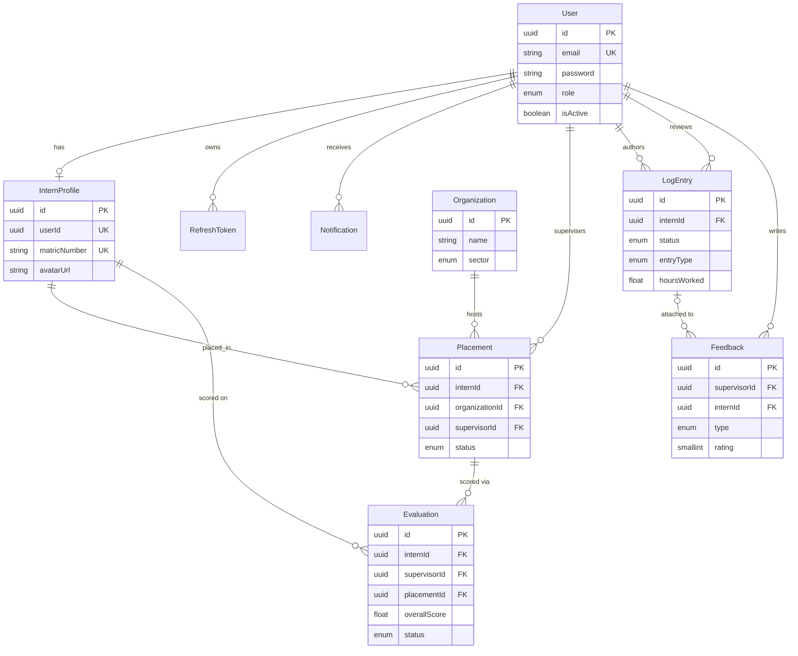

# Intern Management System

> **A production-ready, role-based platform that manages the complete internship lifecycle** from partner organizations and placements, through daily activity logbooks and supervisor feedback, to scored performance evaluations, scorecards, and printable reports.

Built as a **two-app monorepo**: a layered, strictly-typed **Express + Prisma + PostgreSQL** API in `backend/`, and a **Vite + React + Tailwind** single-page application in `frontend/` — both deployable to Vercel as two projects sharing one GitHub repository.

```
┌──────────────────────────────┐        ┌──────────────────────────────┐        ┌────────────────────────┐
│  React SPA (Vercel CDN)      │  REST  │  Express API (Serverless)    │ Prisma │  PostgreSQL            │
│  Role-aware dashboards       │ ─────► │  JWT · RBAC · Validation     │ ─────► │  Users · Placements    │
│  Logbook · Evaluations       │  JSON  │  Services · Repositories     │  SQL   │  Logs · Feedback · Evals│
└──────────────────────────────┘        └──────────────────────────────┘        └────────────────────────┘
```

---

## Table of Contents

- [Why this project stands out](#why-this-project-stands-out)
- [Feature Set](#feature-set)
- [Tech Stack](#tech-stack)
- [Monorepo Layout](#monorepo-layout)
- [System Architecture](#system-architecture)
- [Architectural Decisions](#architectural-decisions)
- [Data Model](#data-model)
- [API Reference](#api-reference)
- [Getting Started](#getting-started)
- [Environment Variables](#environment-variables)
- [Demo Accounts & Seed Data](#demo-accounts--seed-data)
- [Available Scripts](#available-scripts)
- [Deployment](#deployment)
- [Security Posture](#security-posture)
- [Documentation Map](#documentation-map)

---

## Why this project stands out

| Dimension | What was done |
|---|---|
| **Architecture** | Five explicit layers (Routes → Controllers → Services → Repositories → Prisma) with constructor-based dependency injection and repository **interfaces**, so business logic never touches the HTTP layer or the ORM directly. |
| **Primary product scope** | Fill internship programmes with a clear evaluable record of work: partners and placements. A supervisor can only score interns placed under them, and every evaluation is pinned to a placement. |
| **Security depth** | Dual-token JWT (short-lived access + rotating, revocable refresh tokens persisted in the database), bcrypt hashing, RBAC middleware, Helmet, rate limiting, no user enumeration on password reset, and account deactivation support. |
| **Robustness engineering** | Centralized error translation (Prisma `P2002` → `409`, `P2025` → `404`, JWT errors → `401`), one uniform response envelope, and per-origin CORS diagnostics that make production misconfiguration self-explanatory. |
| **Domain modelling** | Nearly 10 entities that capture the entire lifecycle — `Organization → Placement → LogEntry → Feedback → Evaluation` — with deliberate identity semantics split between `User` and `InternProfile`. |
| **Frontend resilience** | The SPA health-checks the API at boot; when the backend is unreachable it degrades into a fully interactive demo mode backed by `localStorage`, which keeps demos and design reviews unblocked. |
| **Print-ready reporting** | A dedicated `@media print` stylesheet (`index.html`) converts the on-screen report view into an A4 document, including page-break and colour-adjust rules — no server-side PDF renderer required. |
| **Deployability** | A serverless adapter (`backend/api/index.ts` + `vercel.json` rewrites) turns the same Express app into a Vercel Function, with Prisma engine targets for the Amazon Linux runtime already configured. |

## Feature Set

### Authentication & Account Lifecycle
- Email/password registration (`INTERN` by default, self-registration is intern-only in the UI), login, logout, and logout-from-all-devices.
- Forgot/reset password flow with a single-use, 1-hour-expiry token; the response is identical whether or not the email exists (anti-enumeration).
- Change-password with current-password verification; **all refresh tokens are revoked** after a password reset.
- Access tokens expire in 15 minutes; refresh tokens rotate on every use and can be revoked server-side.

###  Intern capabilities
- **Profile management** — matric number, faculty, institution, internship dates, contact details, and an avatar uploaded as a base64 data URL (JPEG/PNG/GIF/WebP, ≤ 5 MB).
- **Digital activity logbook** — create `DRAFT` entries (daily/weekly, activity, skills, hours, notes), edit/delete while still a draft, then `SUBMIT` for review. Full history plus dashboard statistics.
- **My evaluations** — read-only view of `COMPLETED`/`REVIEWED` evaluations only, with average and highest score stats (in-progress evaluations are never exposed).
- **Task statistics** — role-aware counters (`total`, `completed`, `inProgress`, `pendingOverdue`) derived from logbook statuses.
- **Personal reports** — generate and print an evaluation report from the reports workspace.

###  Supervisor capabilities
- **Dashboard statistics** and the list of assigned interns (placement-scoped — a supervisor never sees interns they do not supervise).
- **Logbook review queue** — browse submitted entries, approve/reject with review notes, and track feedback history.
- **Feedback that is first-class data** — typed feedback (`GENERAL`, `PERFORMANCE`, `SKILLS`, `CONDUCT`, `GOAL`) with optional rating, strengths, improvements, and a `isPrivate` flag; feedback can be attached to a specific log entry.
- **Skills assessment & performance overview** — per-intern progress, evaluation summaries, executive summary for reports.
- **Scorecards & ranking** — per-intern scorecards with the top 3 performers and an *at-risk* list (score < 30) computed automatically.

### Administrator capabilities
- **Organization directory** — CRUD over partner organizations with industry sector, contact info, and activation state.
- **Placements** — assign interns to organizations, optionally assign a supervisor, track `ACTIVE`/`COMPLETED`/`ON_HOLD`/`TERMINATED`/`PENDING` status, role, department, and dates. Duplicate `(intern, organization)` placements are rejected by a DB-level unique constraint.
- **Evaluations oversight** — filter/paginate all evaluations, review (`REVIEWED` status) or delete them, and access the skills-assessment and summary endpoints.
- **User directory** — query users by role (`INTERN`, `SUPERVISOR`, `MENTOR`) for assignment pickers.
- **Reports** — cross-cutting report data endpoint available to all authenticated roles (intern vs organization report types).

### Cross-cutting product features
- Uniform JSON envelope for every response, with pagination metadata (`page`, `limit`, `totalItems`, `totalPages`, `hasNextPage`, `hasPrevPage`).
- Toast notifications (`sonner`), charts (`recharts`), animated transitions (`motion`), and an accessible component library built on Radix UI primitives (shadcn-style) with a mobile-responsive authenticated shell.
- Notifications model (`Notification` + `NotificationType`) ready for deadline/evaluation alerts.

---

## Tech Stack

| Layer | Technology | Notes |
|---|---|---|
| **Frontend framework** | React 18.3 + TypeScript (strict) | Vite 6.3 build, `@` path alias for `src/` |
| **Styling / UI** | Tailwind CSS 4.1 (`@tailwindcss/vite`), Radix UI primitives, shadcn-style components, `lucide-react` icons, `sonner` toasts, `motion` animations | Component library lives in `frontend/src/app/components/ui` |
| **Data viz** | Recharts | Dashboards and evaluation summaries |
| **Backend framework** | Node.js 20+, Express 4, TypeScript 5.3 | Compiled with `tsc` to `backend/build` |
| **ORM / Database** | Prisma 5.7 + PostgreSQL | UUID PKs, `@db.Uuid`, `@db.SmallInt`, `@db.Text`, indexed relations |
| **Auth** | `jsonwebtoken` (HMAC-signed access/refresh JWTs), `bcrypt` (12 salt rounds) | Access + refresh token pair |
| **Validation** | Joi 17 | Schema-per-module validators with field-level error details |
| **Security middleware** | Helmet, CORS (custom policy), `express-rate-limit` | See [Security Posture](#security-posture) |
| **Logging** | Custom logger (`backend/src/utils/logger.ts`) + Morgan in development | 5xx logged with stack, 4xx logged concisely without noise |


## Monorepo Layout

```
intern-management-system/
├── backend/                          # Express + Prisma API (independent Node app)
│   ├── api/index.ts                  # Vercel serverless entry (re-exports src/app.ts)
│   ├── prisma/
│   │   ├── schema.prisma             # Single source of truth for the data model
│   │   └── seed.ts                   # Idempotent end-to-end demo seed (--reset flag)
│   ├── src/
│   │   ├── app.ts                    # Express app: security, parsing, routes, 404, errors
│   │   ├── server.ts                 # Local bootstrap: reads env, calls app.listen()
│   │   ├── config/                   # environment.ts (fail-fast env), cors.ts, database.ts
│   │   ├── routes/                   # URL + middleware wiring per module (composition root)
│   │   ├── controllers/              # HTTP adapters: parse request, call one service, respond
│   │   ├── services/                 # Business rules, authorization scoping, scoring
│   │   ├── repositories/             # Prisma data access behind interfaces
│   │   │   └── interfaces/           # IUserRepository, IPlacementRepository, ...
│   │   ├── dto/                      # Request/Response contracts per module
│   │   ├── validators/               # Joi schemas (field-level messages)
│   │   ├── middleware/               # auth, rbac, validate, asyncHandler, errorHandler
│   │   ├── utils/                    # ApiError, ApiResponse, token, logger
│   │   └── types/express.ts          # Global Express.Request augmentation (req.user)
│   └── vercel.json                   # Build command + catch-all rewrite to /api
│
├── frontend/                         # Vite + React SPA (independent Node app)
│   ├── src/app/
│   │   ├── App.tsx                   # Auth shell: nav tabs + role-filtered dashboards
│   │   ├── components/               # AuthContext, ProtectedRoute, ui/ (shadcn-style)
│   │   ├── pages/
│   │   │   ├── auth/                 # Welcome, Login, Register, Forgot/Reset/Change pwd
│   │   │   ├── dashboards/           # AdminDashboard, SupervisorDashboard, InternDashboard
│   │   │   ├── logbook/              # Create/Edit/History/Detail + LogDashboard
│   │   │   ├── supervisor/           # Intern list, submitted logs, review, feedback, progress
│   │   │   ├── evaluations/          # Dashboard, Form, Summary, Report pages
│   │   │   ├── intern/               # Evaluation results + detail (read-only)
│   │   │   ├── organizations/        # Organization CRUD + placement management
│   │   │   ├── profile/              # ProfileContext + ProfileDashboard (avatar upload)
│   │   │   └── reports/              # ReportsApp (overview → new → preview → view/export)
│   │   └── utils/authToken.ts        # Token storage with legacy-key compatibility
│   ├── index.html                    # Print stylesheet for A4 report export
│   └── vercel.json                   # SPA fallback rewrite to index.html
│
├── docs/ERD.md                       # Mermaid ERD for the whole data model
├── DEPLOYMENT.md                     # Step-by-step Vercel + Postgres runbook
└── ARCHITECTURE.md                   # Extended design document (local reference)
```

Both apps are **independent npm projects** with their own `package.json`, `.env`, and lockfile — they share nothing at runtime except the HTTP contract.

---

## System Architecture

### High level

```
                    Browser (React SPA, Vite build on Vercel CDN)
                                     │
                          fetch(VITE_API_URL + path)
                                     │  HTTPS · JSON · Bearer <accessToken>
                                     ▼
        ┌──────────────────────── Express API ────────────────────────┐
        │  Helmet → CORS → JSON body parser → Morgan (dev)            │
        │                                                             │
        │  /api/v1/auth · /profile · /organizations · /placements     │
        │  /logbook · /supervisor · /evaluations · /intern/*          │
        │  /scorecards · /tasks · /reports · /users · /health         │
        │                                                             │
        │  Middleware chain per route:                                │
        │    authenticate → authorize(roles) → validate(Joi)          │
        │                                                             │
        │  Routes ──► Controllers ──► Services ──► Repositories       │
        │                                 │            (interfaces)   │
        │                                 └────────────► Prisma Client │
        └─────────────────────────────────────────────┬───────────────┘
                                                      ▼
                                       PostgreSQL (Neon / Supabase)
```

### Internal layers, and why each exists

| Layer | Responsibility | Example |
|---|---|---|
| **Routes** (`src/routes`) | The composition root. Wires middleware order and constructs the dependency graph by hand (`new AuthService(new UserRepository(), ...)`). No logic. | `logbook.routes.ts` |
| **Controllers** | Translate HTTP ⇄ service calls. Wrap handlers in `asyncHandler` so async throws reach the global error handler. Build `ApiResponse`. | `TaskController.getTaskStats` |
| **Services** | All business rules: ownership checks, status transitions, scoring, normalization/rounding, ID resolution, notification intent. Throw `ApiError`s. | `EvaluationService`, `LogbookService` |
| **Repositories** | The only place Prisma is called for domain data. Swappable behind `I*Repository` interfaces; logs and rethrows as `ApiError.internal` on failure. | `EvaluationRepository` |
| **Utils / Middleware** | Cross-cutting: `ApiError`, `ApiResponse`, JWT sign/verify, RBAC, Joi validation, error translation, logger. | `errorHandler.middleware.ts` |

### Request lifecycle (every protected call)

```
POST /api/v1/logbook/:id/submit
  │
  1. helmet()                → secure response headers
  2. cors(corsOptions)       → origin allow-list (or sibling *.vercel.app)
  3. express.json()          → parse body (10 MB cap — accommodates base64 avatars)
  4. morgan('dev')           → request log (development only)
  5. authenticate            → verify Bearer JWT → req.user = { userId, email, role }
  6. authorize('INTERN')     → role gate (403 when outside the allowed set)
  7. validate(...)           → Joi body/query/params validation (400 with field details)
  8. Controller              → parses request, calls exactly one service method
  9. Service                 → loads ownership/state via repositories, enforces rules
 10. Repository              → Prisma query against PostgreSQL
 11. Response                → ApiResponse envelope { success, statusCode, message, data, meta }
     …any throw above lands in    errorHandler → ApiError mapping → logged once
```

---

## Architectural Decisions

The decisions below are the difference between a CRUD demo and a system that can be operated, debugged, and extended. Each one is stated as **context → decision → consequence**.

### 1. Layered architecture with explicit, hand-wired dependency injection

**Context.** Express encourages a single `routes` file that queries the database inline. That collapses testing, authorization, and transport concerns into one place.

**Decision.** Five explicit layers — Routes → Controllers → Services → Repositories → Prisma — composed in the route modules:

```ts
// src/routes/logbook.routes.ts (abridged)
const logEntryRepository = new LogEntryRepository();
const logbookService      = new LogbookService(logEntryRepository);
const logbookController   = new LogbookController(logbookService);
```

**Consequence.** Services depend on abstractions, not on Express or Prisma models. Authorization scoping (`where: { supervisorId }`) has exactly one home per use case. The trade-off is slightly more wiring code and no DI container — a deliberate choice to keep the graph readable and debugging trivial.

### 2. Repository interfaces for every domain aggregate

**Context.** Direct Prisma use in services makes query strategy leak into business rules and makes tests require a real database.

**Decision.** Each aggregate has an interface (`IUserRepository`, `ILogEntryRepository`, `IOrganizationRepository`, `IPlacementRepository`, `IProfileRepository`, `IRefreshTokenRepository`) that the service consumes; the concrete repository is the only Prisma-aware code.

**Consequence.** Query concerns (pagination, `include` strategy, error translation to `ApiError.internal`) are centralized and logged. A stub or in-memory implementation can be substituted without touching business logic.

### 3. DTOs at the boundary + Joi validation before the controller

**Context.** Request shapes drift; `any` leaks through controllers; TypeScript types are erased at runtime.

**Decision.** Two complementary mechanisms:
- **Compile-time** — per-module DTOs (`dto/*.dto.ts`) define `Request`/`Response` contracts used by controllers and services.
- **Runtime** — Joi schemas (`validators/*.validator.ts`) are applied by a generic `validate(schema, source)` middleware with `abortEarly: false` and `stripUnknown: true`, producing structured errors:

```json
{
  "success": false,
  "statusCode": 400,
  "message": "Validation failed",
  "error": {
    "type": "BAD_REQUEST",
    "details": [{ "field": "password", "message": "Password must contain uppercase, lowercase, number, and special character" }]
  },
  "meta": { "timestamp": "..." }
}
```

**Consequence.** Controllers receive sanitized, well-typed input; over-posting is impossible; the UI can map errors to form fields. Password policy (8–128 chars, upper/lower/digit/special) and phone/email formats are enforced identically everywhere because they live in one schema per route.

### 4. One response envelope and one error translator

**Context.** Ad-hoc `res.json` shapes force the frontend to guess; unhandled Prisma/JWT errors leak stack traces as 500s.

**Decision.**
- Every success goes through `ApiResponse<T>` — `{ success, statusCode, message, data, meta }` — with helpers `success`, `created`, `noContent`, `paginated`. Pagination metadata is computed once, server-side.
- Every failure is an `ApiError` (static factories: `badRequest`, `unauthorized`, `forbidden`, `notFound`, `conflict`, `unprocessable`, `internal`) that the global `errorHandler` renders in the same envelope.
- The handler **translates** infrastructure errors instead of exposing them: Prisma `P2002` → `409 CONFLICT`, Prisma `P2025` → `404 NOT_FOUND`, `JsonWebTokenError`/`TokenExpiredError` → `401` (with a distinct `TOKEN_EXPIRED` type the client can react to), everything else → `500` with the real message only in development.

**Consequence.** The SPA has exactly one parsing path and can distinguish "your session expired" from "you lack the role" from "the server broke". Log noise is deliberately split: 5xx logs include structure and (in dev) the stack; 4xx logs are one concise line, so genuine faults stay visible.

### 5. Dual-token authentication with a rotating, revocable refresh token

**Context.** A single long-lived JWT cannot be revoked; a single short-lived one forces constant re-login.

**Decision.** Two separate credentials:
- **Access token** — signed JWT (`{ userId, email, role }`, 15 min default) sent as `Authorization: Bearer …`. Stateless, verified by secret only.
- **Refresh token** — a JWT wrapper around 40 bytes of `crypto` randomness; the random value is persisted in the `refresh_tokens` table (`expiresAt`, `revoked`) and is the actual credential. On refresh the stored record is rotated; logout revokes it; `logout-all` and password reset revoke every token for the user; deactivated accounts cannot log in.

**Consequence.** The blast radius of a stolen access token is ~15 minutes; sessions survive page reloads via the refresh flow; support can terminate sessions server-side. The refresh flow (`POST /auth/refresh`) is a public endpoint protected by the token's own signature *and* the database record.

### 6. RBAC as composable, declarative middleware

**Context.** Role checks scattered through services drift, and "own resource" access is a different rule from "has role".

**Decision.** Two middleware factories in `rbac.middleware.ts`:
- `authorize('SUPERVISOR', 'MENTOR', 'ADMIN', 'SUPER_ADMIN')` — declarative allow-list, mounted per route.
- `authorizeSelfOrRoles(param, ...roles)` — allows the resource owner **or** a privileged role (used where a user must reach their own record).

Roles are the Prisma enum `UserRole`: `SUPER_ADMIN`, `ADMIN`, `SUPERVISOR`, `MENTOR`, `INTERN`; `req.user` is typed globally via `src/types/express.ts` so `req.user!.role` is safe in handlers.

**Consequence.** The permission matrix is auditable by reading route files. Layer two of enforcement lives in services: a supervisor's queries are scoped by `supervisorId`, so even a hand-crafted request cannot read another supervisor's interns — RBAC decides *whether*, the service decides *whose*.

### 7. Two identity concepts — `User` vs `InternProfile` — resolved in the service layer

**Context.** Authentication needs a lightweight record (`User`), but the internship domain needs academic data (matric number, faculty, institution, dates). Real-world clients also send "the intern's ID" without knowing which table it came from.

**Decision.** `InternProfile` is a 1:1 satellite of `User` (`userId` unique). The domain graph is deliberately split:
- `LogEntry.internId → User.id` (activity is authored by the account),
- `Placement.internId → InternProfile.id` (a placement is an internship fact),
- `Evaluation.internId → InternProfile.id` (scores belong to the internship record),
and services expose a small resolver so both forms are accepted:

```ts
// EvaluationService / InternEvaluationService
const profile = await prisma.internProfile.findFirst({
  where: { OR: [{ id: internId }, { userId: internId }] },
});
if (!profile) throw ApiError.notFound('Intern profile not found for the given intern ID');
```

**Consequence.** The API is forgiving for frontends and third-party callers without weakening referential integrity, and the FK migration (`20260623144725_evaluation_intern_fk_to_profile`) made evaluations survive profile edits. The cost is one extra lookup per write, mitigated by the unique index on `userId`.

### 8. The same Express app runs locally *and* as a Vercel Function

**Context.** Vercel cannot host a long-running process; `server.ts` calls `app.listen()`. Prisma's default engine also does not match Vercel's Amazon Linux runtime.

**Decision.** Split the app from its bootstrap:
- `src/app.ts` builds and exports the configured Express app (no `listen`).
- `src/server.ts` imports it and binds a port for local development.
- `api/index.ts` re-exports the app as a serverless handler and `vercel.json` rewrites every path to it — so the existing `/api/v1/*` routes continue to work unchanged.
- `schema.prisma` declares `binaryTargets = ["native", "rhel-openssl-3.0.x"]` so the query engine is present in both environments.

```ts
// backend/api/index.ts
import app from '../src/app';
export default function handler(req: any, res: any) {
  return app(req, res);
}
```

**Consequence.** Zero code duplication between environments and one deployment artifact. The trade-off is serverless reality: in-memory rate limiting is per-instance (approximate), cold starts add ~1–3 s, and the database must be a pooled endpoint — documented in `DEPLOYMENT.md §11`.

### 9. CORS configured for real deployments, with actionable diagnostics

**Context.** Vercel gives every deployment and preview its own hostname. A single hard-coded origin breaks previews, and a trailing slash in `FRONTEND_URL` silently blocks the browser — classic production incidents.

**Decision.** A dedicated policy in `src/config/cors.ts`:
- `FRONTEND_URL` accepts a **comma-separated origin list**; each origin is normalized (whitespace + trailing slashes removed) before comparison.
- Setting `FRONTEND_URL=*` allows any origin for demos.
- For each configured `https://*.vercel.app` origin, sibling hosts sharing the same project prefix are accepted (deployment/preview URLs) — controlled by `ALLOW_VERCEL_DEPLOYMENT_URLS`, which can be disabled to require exact origins.
- Requests without an `Origin` header (curl, health checks, server-to-server) always pass, because CORS exists to constrain browsers.
- A blocked origin is logged **once** with the exact value to add: `CORS: blocked origin "https://…" . Allowed: …`.
- Preflight results are cached (`maxAge: 86400`) so browsers stop issuing one `OPTIONS` per request.

**Consequence.** Preview deployments work out of the box without loosening security beyond the project prefix, and the most common misconfiguration self-diagnoses from the server logs.

### 10. A normalized scoring engine with role-appropriate visibility

**Context.** Evaluations have seven criteria that supervisors may fill partially; scores must be comparable across interns regardless of which criteria were filled in.

**Decision.** The service computes the overall score, never the client:

```ts
// sum of provided criteria ÷ (count × 10) × 100 → 0–100, rounded
const values = Object.values(scores).filter((v): v is number => typeof v === 'number');
return Math.round((values.reduce((a, v) => a + v, 0) / (values.length * 10)) * 100);
```

Criteria: `attendance`, `technicalSkills`, `communication`, `teamwork`, `initiative`, `problemSolving`, `professionalConduct` (each 1–10). Evaluations are **pinned to a placement**; the service verifies the placement belongs to the submitting supervisor, and only one evaluation per placement is allowed. `GET /intern/evaluations` filters to `COMPLETED`/`REVIEWED` only; the scorecard endpoint derives top-3 and at-risk (< 30) lists from the same data.

**Consequence.** Scores are consistent and tamper-resistant, partial assessments are still meaningful, and interns never see in-progress judgments. Weighting is equal by design — per-criterion weights are the natural next step (see roadmap).

### 11. Logbook as an explicit state machine

**Context.** Free-form editing of reviewed records destroys the audit value of a logbook.

**Decision.** `DRAFT → SUBMITTED → APPROVED | REJECTED` is enforced by the service, not just the UI:
- Only the owning intern can create/edit/delete, and only while `DRAFT`; submitting a non-draft is rejected.
- Only `SUPERVISOR`/`MENTOR`/`ADMIN`/`SUPER_ADMIN` may review; the reviewer identity (`reviewedBy`) and timestamp are stamped server-side.
- Every status transition is a named endpoint (`PATCH /:id/submit`, `PATCH /:id/review`) rather than a generic field update, so each transition can grow its own rules (e.g. feedback creation, notifications) safely.

**Consequence.** The history is trustworthy and the same statuses feed the task-statistics endpoints, the supervisor review queue, and dashboard counters without duplicating logic.

### 12. Frontend: one authenticated shell, context-based session, role-filtered modules

**Context.** Three personas (intern, supervisor, admin) need different screens without maintaining three SPAs.

**Decision.**
- `AuthProvider` (React Context) owns the session: `user`, `token`, `loading`, API connectivity, and all auth operations. `ProtectedRoute` gates views by authentication and optional `allowedRoles`.
- `App.tsx` renders a single responsive shell whose navigation is filtered by role and whose content area swaps modules (dashboard, logbook, evaluations, organizations, placements, reports, profile/settings).
- Token persistence is centralized in `frontend/src/app/utils/authToken.ts`, which writes **both** the canonical `accessToken` key and the legacy `token` key so un-migrated call sites keep working — a small compatibility decision that prevented a breaking change across ~20 screens.

**Consequence.** One login, one shell, one place to change session behaviour. Role restrictions are enforced client-side for UX *and* server-side for security.

### 13. Graceful degradation: the SPA has a demo mode

**Context.** Design reviews, demos, and offline frontend work are regularly blocked by "the API/database isn't up".

**Decision.** At boot the `AuthProvider` probes `GET /api/v1/health`. If the backend is unavailable, it flips into **mock mode**: seeded demo users are kept in `localStorage` (`mock_users`, `mock_users_passwords`) and auth flows resolve against them; a `isMockMode` flag lets guards relax role checks for exploration.

**Consequence.** The UI is always demonstrable, and the same flag makes it obvious whether you are talking to the real API or to local state. This is a developer-experience feature, not a security boundary — production must point `VITE_API_URL` at a live API.

### 14. Print-first reporting instead of a server-side PDF pipeline

**Context.** Stakeholders need shareable PDFs of intern/organization reports. Server-side rendering with Puppeteer adds a heavy Chromium dependency (and a poor fit for serverless cold starts).

**Decision.** Reports are rendered as real DOM (charts, scorecards, sections), and a dedicated `@media print` stylesheet in `index.html` turns the same view into an A4 document:
- `@page { size: A4; margin: 2cm }`,
- navigation/buttons hidden (`.no-print`, `button`, `nav`, `header`),
- a `body.report-view-mode` class isolates the report pane from the app shell,
- background colours forced with `print-color-adjust: exact` so branding survives printing,
- `break-inside: avoid` on cards so tables and scorecards do not split across pages.

**Consequence.** Pixel-identical "View → Save as PDF" with zero server infrastructure. (`puppeteer`/`pdfkit` remain in `backend/package.json` from an earlier plan but are not wired to any route — removing them shrinks install time and serverless bundle size.)

### 15. Performance and integrity by schema, not by convention

**Context.** Dashboards aggregate counts by status; supervisors filter by placement; every list is paginated.

**Decision.** The Prisma schema indexes exactly the access paths the API actually uses, e.g.:
- `LogEntry @@index([internId, status])`, `@@index([internId, logDate])`, `@@index([reviewedBy])`
- `Placement @@unique([internId, organizationId])`, `@@index([organizationId])`, `@@index([supervisorId])`, `@@index([status])`
- `Evaluation @@index([internId])`, `@@index([supervisorId])`, `@@index([placementId])`, `@@index([status])`, `@@index([createdAt])`
- `Notification @@index([userId, isRead])`, `@@index([createdAt])`; `RefreshToken @@index([userId])`, `@@index([token])`

Composite indexes lead with the column used for equality (`internId`), which is why "my logs by status" is a single index range scan. Counts across a supervisor's interns use `where: { internId: { in: ids } }` with `Promise.all` so the four status counters run concurrently instead of sequentially.

**Consequence.** List endpoints stay fast as data grows, duplicates are impossible at the database level, and the indexes document the product's query patterns.

---

## Data Model

PostgreSQL, modelled with Prisma. All primary keys are UUIDs (`@db.Uuid`); every table is explicitly `@@map`ped to snake_case. The complete mermaid ERD lives in [`docs/ERD.md`](docs/ERD.md).

| Model | Table | Purpose | Notable constraints |
|---|---|---|---|
| `User` | `users` | Account + identity. `role` drives access; `isActive` disables login. | `email` unique; bcrypt `password`; `resetToken` + `resetTokenExp` for password recovery |
| `RefreshToken` | `refresh_tokens` | Revocable session records. | `token` unique; `revoked` flag; `onDelete: Cascade` from `User` |
| `Notification` | `notifications` | User-targeted messages (`INFO`, `WARNING`, `SUCCESS`, `ERROR`, `DEADLINE`, `EVALUATION`) with optional deep `link`. | Indexed by `(userId, isRead)` |
| `InternProfile` | `intern_profiles` | Internship identity: matric number, faculty, institution, avatar, internship dates, cached supervisor/organization names. | `userId` unique (1:1); `matricNumber` unique |
| `Organization` | `organizations` | Partner organization with `IndustrySector` and contact block. | Indexed by `sector`, `name` |
| `Placement` | `placements` | Intern ↔ Organization engagement, optional supervisor, `PlacementStatus`, role/department/dates. | `@@unique([internId, organizationId])`; FKs to `InternProfile` and `User` |
| `LogEntry` | `log_entries` | Daily/weekly activity record with skills, hours, notes, review trail. | `LogStatus` machine; reviewer FK `SetNull`-safe; composite indexes |
| `Feedback` | `feedbacks` | Supervisor feedback, optionally attached to a log entry. | `FeedbackType`; `isPrivate`; `logEntry` FK `onDelete: SetNull` |
| `Evaluation` | `evaluations` | Scored performance review with 7 criteria, computed `overallScore`, strengths/improvements, review trail. | FK to `InternProfile`, `User` (supervisor), `Placement`; one per placement enforced in the service |

### Relationship rules worth knowing

```
User 1───0..1 InternProfile ──┬── * Placement * ── 1 Organization
  │                          │        │
  │  (authored)              │        │ (scored)
  *                          │        *
LogEntry ──0..1 Feedback     └── * Evaluation ── 1 User (supervisor)
  *                                 │
  └──── * Feedback ──── *(private/public)──► intern User
```

- **Placements reference `InternProfile`**, not `User` — an intern must have a profile before they can be placed.
- **Log entries and feedback reference `User`** — authorship is an account concept.
- **Evaluations reference `InternProfile` + `Placement` + `User` (supervisor)**, and may be reviewed by an `ADMIN`/`SUPER_ADMIN` (`reviewedBy`).
- Cascade behaviour is chosen per relation: deleting a user cascades to their tokens, notifications, profile, logs, feedback, and evaluations; deleting a log entry only detaches feedback (`SetNull`) so comments are not silently destroyed.

<details>
<summary> Abridged ERD (mermaid)</summary>



</details>

---

## API Reference

**Base URL:** `/api/v1` (local: `http://localhost:3000/api/v1`)

**Conventions**
- Authentication: `Authorization: Bearer <accessToken>` on every route except the public auth endpoints.
- Success/error envelopes are uniform (see [decision 4](#4-one-response-envelope-and-one-error-translator)).
- List endpoints return `meta.page`, `meta.limit`, `meta.totalItems`, `meta.totalPages`, `meta.hasNextPage`, `meta.hasPrevPage`.
- Dates are ISO-8601 strings; scores are integers 1–10 per criterion; `overallScore` is 0–100.

### System

| Method | Endpoint | Access | Description |
|---|---|---|---|
| GET | `/health` | Public | Liveness probe — environment + timestamp |

### Auth — `/auth`

| Method | Endpoint | Access | Description |
|---|---|---|---|
| POST | `/register` | Public | Create an account (role defaults to `INTERN`) |
| POST | `/login` | Public | Returns `accessToken`, `refreshToken`, and the user profile |
| POST | `/refresh` | Public (refresh token in body) | Rotates the refresh token and issues a new access token |
| POST | `/forgot-password` | Public | Always `200` — prevents account enumeration |
| POST | `/reset-password` | Public | Consumes the emailed reset token; revokes all sessions |
| POST | `/logout` | Authenticated | Revokes the supplied refresh token |
| POST | `/logout-all` | Authenticated | Revokes every refresh token for the caller |
| GET | `/me` | Authenticated | Current user (id, email, name, role, phone, isActive, lastLoginAt) |
| PATCH | `/change-password` | Authenticated | Requires `currentPassword`; enforces the password policy |

### Profile — `/profile`

| Method | Endpoint | Access | Description |
|---|---|---|---|
| GET | `/me` | Any authenticated role | Fetch the caller's profile (creates nothing) |
| POST | `/` | Any authenticated role | Create or update the full profile (upsert) |
| PATCH | `/contact` | Any authenticated role | Update contact info (phone) |
| PUT | `/avatar` | Any authenticated role | Upload a base64 data-URL avatar (JPEG/PNG/GIF/WebP, ≤ 5 MB) |

> Profile routes carry a dedicated rate limiter: **30 requests / 15 min**, and avatar uploads **10 / hour**.

### Users — `/users`

| Method | Endpoint | Access | Description |
|---|---|---|---|
| GET | `/?role=INTERN\|SUPERVISOR\|MENTOR` | `ADMIN`, `SUPER_ADMIN`, `SUPERVISOR`, `MENTOR` | Directory lookup for assignment pickers (includes `internProfile`) |

### Organizations — `/organizations`

| Method | Endpoint | Access | Description |
|---|---|---|---|
| POST | `/` | `ADMIN`, `SUPER_ADMIN` | Create an organization |
| GET | `/` | `ADMIN`, `SUPER_ADMIN` | List organizations |
| GET | `/:id` | `ADMIN`, `SUPER_ADMIN` | Organization detail |
| PUT | `/:id` | `ADMIN`, `SUPER_ADMIN` | Update an organization |
| DELETE | `/:id` | `ADMIN`, `SUPER_ADMIN` | Delete an organization |

### Placements — `/placements`

| Method | Endpoint | Access | Description |
|---|---|---|---|
| POST | `/` | `ADMIN`, `SUPER_ADMIN` | Place an intern with an organization |
| GET | `/` | `ADMIN`, `SUPER_ADMIN`, `SUPERVISOR` | List placements (paginated) |
| GET | `/:id` | `ADMIN`, `SUPER_ADMIN`, `SUPERVISOR` | Placement detail |
| PUT | `/:id` | `ADMIN`, `SUPER_ADMIN`, `SUPERVISOR` | Update placement (status, role, dates, notes) |
| POST | `/:id/assign-supervisor` | `ADMIN`, `SUPER_ADMIN` | Assign/replace the supervising user |
| DELETE | `/:id` | `ADMIN`, `SUPER_ADMIN` | Remove a placement |

### Logbook — `/logbook`

| Method | Endpoint | Access | Description |
|---|---|---|---|
| POST | `/` | `INTERN` | Create a `DRAFT` log entry |
| GET | `/mine` | `INTERN` | The caller's own entries |
| GET | `/dashboard/stats` | `INTERN` | Counts by status for the intern dashboard |
| PATCH | `/:id/submit` | `INTERN` | Move a draft to `SUBMITTED` |
| PATCH | `/:id` | `INTERN` | Edit a draft only |
| DELETE | `/:id` | `INTERN` | Delete a draft only |
| GET | `/` | `SUPERVISOR`, `MENTOR`, `ADMIN`, `SUPER_ADMIN` | All entries (filterable) |
| PATCH | `/:id/review` | `SUPERVISOR`, `MENTOR`, `ADMIN`, `SUPER_ADMIN` | Approve/reject with review notes |
| GET | `/:id` | Any authenticated user with access | Single entry detail |

### Supervisor — `/supervisor`

| Method | Endpoint | Access | Description |
|---|---|---|---|
| GET | `/dashboard/stats` | `SUPERVISOR`, `MENTOR`, `ADMIN`, `SUPER_ADMIN` | Dashboard counters |
| GET | `/interns` | same | Assigned interns (placement-scoped) |
| GET | `/submitted-logs` | same | Review queue |
| PATCH | `/logs/:id/review` | same | Review a log |
| GET | `/interns/:internId/progress` | same | Per-intern progress timeline |
| GET | `/report/summary` | same | Executive summary for reports |
| POST | `/feedback` | same | Create feedback (optionally tied to a log entry) |
| GET | `/feedback` | same | Feedback authored by the caller |
| GET | `/interns/:internId/feedback` | same | Feedback for one intern |
| DELETE | `/feedback/:id` | same | Remove feedback |

### Evaluations — `/evaluations`

| Method | Endpoint | Access | Description |
|---|---|---|---|
| POST | `/` | `SUPERVISOR`, `MENTOR`, `ADMIN`, `SUPER_ADMIN` | Create an evaluation (placement must belong to the supervisor) |
| GET | `/` | same | Paginated, filterable list |
| GET | `/summary` | same | Aggregate metrics |
| GET | `/skills-assessment` | same | Skill breakdown for report previews |
| GET | `/:id` | same + `INTERN` | Evaluation detail |
| PUT | `/:id` | `SUPERVISOR`, `MENTOR`, `ADMIN`, `SUPER_ADMIN` | Update scores/comments (recalculates `overallScore`) |
| PATCH | `/:id/complete` | `SUPERVISOR`, `MENTOR`, `ADMIN`, `SUPER_ADMIN` | Mark `COMPLETED` |
| PATCH | `/:id/review` | `ADMIN`, `SUPER_ADMIN` | Mark `REVIEWED` (final sign-off) |
| GET | `/intern/:internId` | `SUPERVISOR`, `MENTOR`, `ADMIN`, `SUPER_ADMIN` | Evaluations for an intern |
| GET | `/supervisor/me` | same | Evaluations authored by the caller |
| DELETE | `/:id` | `SUPERVISOR`, `MENTOR`, `ADMIN`, `SUPER_ADMIN` | Delete an evaluation |

### Intern self-service — `/intern/evaluations`

| Method | Endpoint | Access | Description |
|---|---|---|---|
| GET | `/` | `INTERN` | Own evaluations — **only** `COMPLETED`/`REVIEWED` — plus stats (total, average, highest) |
| GET | `/:evaluationId` | `INTERN` | Own evaluation detail (ownership enforced) |

### Scorecards — `/scorecards`

| Method | Endpoint | Access | Description |
|---|---|---|---|
| GET | `/` | `SUPERVISOR`, `ADMIN`, `SUPER_ADMIN` | Per-intern scorecard rows (name, matric, attendance, score, status) |
| GET | `/ranking` | same | `topPerformers` (top 3) and `atRiskInterns` (score < 30) |

### Tasks — `/tasks`

| Method | Endpoint | Access | Description |
|---|---|---|---|
| GET | `/stats` | Any authenticated role | Role-aware counts: interns see their own, supervisors see their interns', admins see everything |

### Reports — `/reports`

| Method | Endpoint | Access | Description |
|---|---|---|---|
| GET | `/:reportType?` | Any authenticated role | Structured report payload (`intern` \| `organization`) for the printable report workspace |

---

## Getting Started

### Prerequisites

| Requirement | Version / notes |
|---|---|
| Node.js | **20+** (Vercel runtime and `@types/node@20` assume this) |
| npm | 9+ (each app has its own lockfile) |
| PostgreSQL | 14+ — local server, Docker container, or a free Neon/Supabase instance |
| Git | any recent version |

### 1. Clone

```bash
git clone https://github.com/Yamuhammad01/Intern-Management-System.git
cd intern-management-system
```

### 2. Backend

```bash
cd backend
npm install                 # also generates the Prisma client

cp .env.example .env        # Windows (PowerShell): Copy-Item .env.example .env
# then edit .env — DATABASE_URL, JWT_ACCESS_SECRET and JWT_REFRESH_SECRET are required
```

`src/config/environment.ts` **fails fast**: the process refuses to boot without `DATABASE_URL`, `JWT_ACCESS_SECRET`, and `JWT_REFRESH_SECRET`, so misconfiguration is caught at startup, not on the first request.

```bash
npm run prisma:push         # sync schema.prisma to your database
npm run prisma:seed         # optional: rich end-to-end demo dataset
npm run dev                 # nodemon + ts-node → http://localhost:3000/api/v1
```

Verify: `GET http://localhost:3000/api/v1/health` →

```json
{ "success": true, "statusCode": 200, "message": "Server is running",
  "data": { "environment": "development", "timestamp": "..." } }
```

> **Database workflow note.** `backend/.gitignore` intentionally excludes `prisma/migrations`, so a fresh clone has **no migration history**. The supported workflow is `npm run prisma:push` (schema push). If you prefer versioned migrations, force-add the folder (`git add -f prisma/migrations`) before deploying, otherwise Vercel builds that run `prisma migrate deploy` will fail with *“No migration found”*.

### 3. Frontend

```bash
cd ../frontend
npm install

cp .env.example .env        # Windows (PowerShell): Copy-Item .env.example .env
# VITE_API_URL=http://localhost:3000/api/v1   ← must include /api/v1 and have NO trailing slash

npm run dev                 # Vite dev server → http://localhost:5173
```

`VITE_API_URL` is **inlined at build time** by Vite. Changing it requires restarting the dev server (or redeploying in production) — this is the single most common "the frontend calls localhost in production" cause and is called out in `DEPLOYMENT.md`.

If the backend is not running, the SPA still boots into **demo mode** using seeded `localStorage` users (see [decision 13](#13-graceful-degradation-the-spa-has-a-demo-mode)).

### 4. One-command recap

```bash
# Terminal 1
cd backend  && npm install && npm run prisma:push && npm run prisma:seed && npm run dev

# Terminal 2
cd frontend && npm install && npm run dev
```

---

## Environment Variables

### `backend/.env`

| Variable | Required | Default | Purpose |
|---|---|---|---|
| `NODE_ENV` | No | `development` | Enables Morgan logging and verbose error messages in development |
| `PORT` | No | `3000` | API port for local/serverful deployments |
| `DATABASE_URL` | **Yes** | — | PostgreSQL connection string. Use the **pooled** endpoint in serverless environments |
| `JWT_ACCESS_SECRET` | **Yes** | — | Signs short-lived access tokens |
| `JWT_REFRESH_SECRET` | **Yes** | — | Signs refresh tokens (use a different value from the access secret) |
| `JWT_ACCESS_EXPIRES_IN` | No | `15m` | Access-token lifetime |
| `JWT_REFRESH_EXPIRES_IN` | No | `7d` | Refresh-token lifetime |
| `BCRYPT_SALT_ROUNDS` | No | `12` | Password hashing cost |
| `FRONTEND_URL` | No | `http://localhost:5173` | CORS allow-list: one origin, a comma-separated list, or `*` (no trailing slash) |
| `ALLOW_VERCEL_DEPLOYMENT_URLS` | No | `true` | Accept sibling `*.vercel.app` preview/deployment hostnames of configured origins |
| `SMTP_HOST` / `SMTP_PORT` / `SMTP_USER` / `SMTP_PASS` / `SMTP_FROM` | No | — | Reserved for outbound email (password-reset delivery — see roadmap) |

### `frontend/.env`

| Variable | Required | Default in code | Purpose |
|---|---|---|---|
| `VITE_API_URL` | **Yes** (for real data) | `http://localhost:3000/api/v1` (auth) / `http://localhost:3000/api` (some legacy modules) | API root **including** `/api/v1`, no trailing slash |

> Always set `VITE_API_URL` explicitly. Several modules fall back to a bare `/api` default, which only works if the value is provided.

---

## Demo Accounts & Seed Data

`npm run prisma:seed` builds a complete, realistic dataset (Nigerian partner organizations such as Flutterwave, Interswitch, NCC, Zenith Bank, Seplat Energy, and Andela) covering the whole flow:

```
Organization → InternProfile → Placement (with supervisor)
   → Logbook entries (DRAFT / SUBMITTED / APPROVED / REJECTED)
   → Supervisor feedback → Evaluations (with computed scores) → Notifications
```

| Role | Email | Password |
|---|---|---|
| Intern | `intern@internhub.com` | `Password123!` |
| Supervisor | `supervisor@internhub.com` | `Password123!` |
| Administrator | `admin@internhub.com` | `Password123!` |

Seed behaviour:
- **`npm run prisma:seed`** — idempotent: removes and re-creates only the demo rows, leaving your own data intact.
- **`npm run prisma:seed:reset`** — wipes every table first for a clean demo database.

The seed mirrors the production scoring formula (`overallScore = Σ(scores) / (n × 10) × 100`), so the demo data always agrees with what the API would compute.

---

## Available Scripts

### `backend/`

| Script | Command | What it does |
|---|---|---|
| `npm run dev` | `nodemon src/server.ts` | Hot-reloading dev server (ts-node) |
| `npm run dev:debug` | `nodemon --exec node --inspect=9229 -r ts-node/register src/server.ts` | Dev server with an attached debugger on port **9229** (matches `.vscode/launch.json`) |
| `npm run build` | `prisma generate && tsc` | Generates the Prisma client and compiles to `build/` |
| `npm start` | `node build/server.js` | Runs the compiled server (production/serverful) |
| `npm run prisma:generate` | `prisma generate` | Regenerate the typed client |
| `npm run prisma:push` | `prisma db push` | Push schema changes without migration files |
| `npm run prisma:migrate` | `prisma migrate dev` | Create/apply a versioned migration (local development) |
| `npm run prisma:seed` / `prisma:seed:reset` | `ts-node prisma/seed.ts [--reset]` | Demo dataset (see above) |
| `npm test` | — | Placeholder — **no automated tests yet** (see roadmap) |

### `frontend/`

| Script | Command | What it does |
|---|---|---|
| `npm run dev` | `vite` | Dev server on port **5173** with HMR |
| `npm run build` | `vite build` | Production bundle in `dist/` |

---

## Deployment

The full runbook is in **[`DEPLOYMENT.md`](DEPLOYMENT.md)**. The short version:

**Architecture:** two Vercel projects from one repository + an external PostgreSQL database.

| Vercel project | Root Directory | Type | Serves |
|---|---|---|---|
| `intern-management-backend` | `backend` | Serverless Function | Express API at `/api/v1/*` |
| `intern-management-frontend` | `frontend` | Static (Vite) | React SPA |

```bash
# 1. Provision PostgreSQL (Neon / Supabase / Railway) and copy the POOLED connection string.
# 2. Backend project → Root Directory: backend
#    Env: DATABASE_URL, JWT_ACCESS_SECRET, JWT_REFRESH_SECRET,
#         NODE_ENV=production, FRONTEND_URL=https://<frontend>.vercel.app
#         (add PUPPETEER_SKIP_DOWNLOAD=true to avoid downloading unused Chromium)
# 3. Sync the schema once from your machine:
cd backend && npm run prisma:push && npm run prisma:seed
# 4. Frontend project → Root Directory: frontend
#    Env: VITE_API_URL=https://<backend>.vercel.app/api/v1   ← no trailing slash
# 5. Redeploy the frontend whenever VITE_API_URL changes (Vite inlines it at build time).
```

Deployment-specific design choices already baked into the repo:
- `backend/api/index.ts` + `backend/vercel.json` (catch-all rewrite to the serverless handler, `prisma generate` on build).
- `backend/prisma/schema.prisma` declares the `rhel-openssl-3.0.x` Prisma engine for Vercel's Amazon Linux runtime.
- `frontend/vercel.json` adds the SPA fallback rewrite to `index.html`.
- CORS accepts sibling `*.vercel.app` deployment/preview URLs of the configured frontend origin.
- **Always use a pooled database endpoint** — serverless functions open many short-lived connections.

---

## Security Posture

| Control | Implementation |
|---|---|
| Password storage | `bcrypt` with a configurable cost (default 12); passwords never logged or returned |
| Password policy | Min 8 / max 128 chars, requiring upper, lower, digit, and special character (Joi, enforced on register, reset, and change) |
| Session strategy | 15-minute access JWT + rotating server-side refresh tokens; `logout-all`; revocation on password reset; `isActive` gate at login |
| Authorization | Route-level RBAC (`authorize`) **plus** service-level ownership scoping (supervisors only ever query their own placements/interns); interns can only read their own evaluations, and only after they are final |
| Input validation | Joi schemas on body/query/params with `stripUnknown`, so unknown fields can never reach Prisma |
| SQL injection | Impossible by construction — Prisma parameterizes every query; no raw SQL in the codebase |
| Transport hardening | Helmet default header set; CORS allow-list (never `*` with credentials in practice); JSON body capped at 10 MB |
| Abuse controls | `express-rate-limit` on profile reads/writes (30 / 15 min) and avatar uploads (10 / hour) |
| Enumeration resistance | `forgot-password` always returns the same 200 response whether or not the account exists; login errors never reveal which field was wrong |
| Error hygiene | Stack traces and raw error messages only in development; production 5xx responses are generic while the full error is logged server-side |
| Data integrity | FKs with deliberate `onDelete` behaviour, unique constraints on `email`, `matricNumber`, `(intern ⊗ organization)`, and one-evaluation-per-placement in the service |
| Audit trail | Reviewer identity/timestamp on logs and evaluations; `lastLoginAt` on users |

> **Before exposing a fork publicly:** set `ALLOW_VERCEL_DEPLOYMENT_URLS=false` (exact origins only), rotate all JWT secrets, and review the roadmap item about self-registration role selection.


---

## Documentation Map

| Document | Contents |
|---|---|
| **`README.md`** (this file) | Product overview, architecture, decisions, API reference, setup |
| **`DEPLOYMENT.md`** | Complete Vercel deployment runbook, environment matrix, troubleshooting table |
| **`docs/ERD.md`** | Mermaid entity-relationship diagram for every model |
| **`ARCHITECTURE.md`** | Extended design document (system architecture, folder rationale, roadmap) — present in the working tree, excluded from git by the root `.gitignore` |
| **`PROFILE_PICTURE_IMPLEMENTATION_PLAN.md`** | Feature specification for base64 avatar upload (schema → DTO → UI) |
| **`frontend/ATTRIBUTIONS.md`** | Credits for the Figma-derived UI bundle (`frontend/README.md` links the original design file) |

Fast path for a new contributor: this README → run the [Getting Started](#getting-started) steps → read `backend/src/routes/index.ts` to see every module → open the route file for the module you care about; it tells you exactly which controller, service, and repository to follow.

---

## License

This project is licensed under the MIT License.

---
## Author
Muhammad Idris

• GitHub: https://github.com/Yamuhammad01 <br>
• LinkedIn: https://www.linkedin.com/in/muhammad-idrisb2/ <br>
• Email: idrismuhd814@gmail.com <br>
• Live Demo: https://intern-management-system-kdjk.vercel.app/ <br>

---
